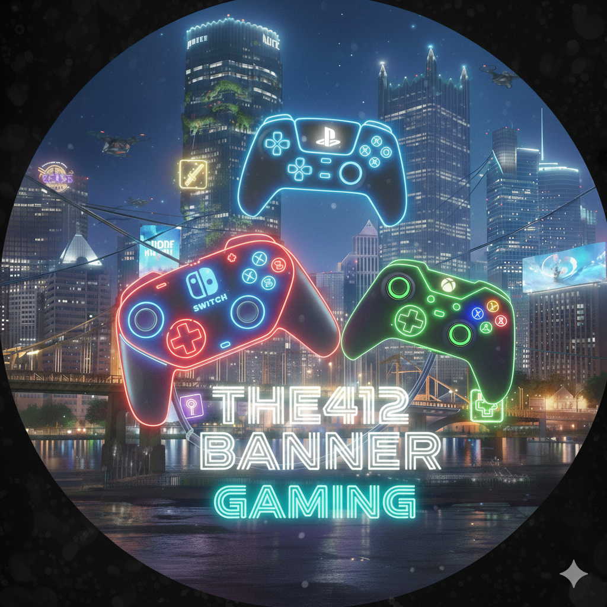

  

<h3 align="center">The412Banner Nightly Repo for Winlator Emulation</h3>

I borrowed most of this readme from Arihany from her GitHub WCP Repo, the best I've found to this day if I am being honest.  found here:

https://github.com/Arihany/WinlatorWCPHub 

---

> | Bionic builds | 📖 |
> |:-:|-|
> | [**Winlator-CMod**](https://github.com/coffincolors/winlator/releases) | Baseline Bionic build with excellent controller support. |
> | [**Winlator-Ludashi**](https://github.com/StevenMXZ/Winlator-Ludashi/releases) | Keeps up with the latest upstream code while remaining close to vanilla. Great performance. |
> | [**GameNative**](https://github.com/utkarshdalal/GameNative/releases) | Supports both glibc and bionic, featuring a sleek UI and Steam integration. |
> 
>
> ---
> 
> 

>  
> Updates daily at 04:00 AM EST 

---

### ⚙️ General Modern Mono Settings

| FEXCore | 🏷️ | 📖 |
|:-:|:-:|-|
| **TSO** | `1` | Keep as is. |
| **MEMCPYSETTSO** | `0` | If you still get crashes/freezes with `TSO = 1`, set this to `1`. | 
| **VECTORTSO** | `0` | If you still get crashes/freezes with `TSO = 1` `MEMCPYSETTSO = 1`, set this to `1`. Very heavy. |
| **HALFBARRIERTSO** | `1` | Keep as is. |
| **MULTIBLOCK** | `0` | Once TSO-related settings are stable, you can try `1` for potential performance gains. |

| Box64 | 🏷️ | 📖 |
|:-:|:-:|-|
| **SAFEFLAGS** | `1` | If you still get crashes/freezes, set this to `2`. Very heavy. |
| **STRONGMEM** | `1` | If you still get crashes/freezes, set this to `2`. Very heavy. |
| **WEAKBARRIER** | `1` | Reduces the performance cost of `STRONGMEM`. Set to `0` if the game crashes. |
| **BIGBLOCK** | `0-2` | Official recommendation is `0`, but `2` often works fine in practice. |
| **FORWARD** | `128-256` | Higher values mainly increase the risk of subtle, unpredictable side effects. |
| **CALLRET** | `0` | Keep as is. |
| **WAIT** | `1` | `0` might help performance in heavily multithreaded or JIT-heavy workloads. |

- If you see graphics/animation/physics glitches in older games, try experimenting with `BOX64_FASTNAN` `BOX64_FASTROUND` `BOX64_X87DOUBLE` `FEX_X87REDUCEDPRECISION`

---

<h3 align="center">Additional Packages</h3>

---

### 🔥 Adreno Driver
| Link | 📖 |
|:-:|-|
| [**StevenMXZ**](https://github.com/StevenMXZ/freedreno_turnip-CI/releases) | Mesa Turnip driver |
| [**K11MCH1**](https://github.com/K11MCH1/AdrenoToolsDrivers/releases) | Qualcomm proprietary driver + Mesa Turnip driver |
| [**GameNative**](https://gamenative.app/drivers/) | Qualcomm proprietary driver + Mesa Turnip driver |
| [**zoerakk**](https://github.com/zoerakk/qualcomm-adreno-driver/releases) | Qualcomm proprietary driver (ELITE) |

  
💡Quick Info

  
  
| Type | 📖 |
|:-:|-|
| **Qualcomm driver** | Extracted from the official Adreno driver of a recent device. Partially compatible with similar chipsets. Emulation may show reduced performance or rendering glitches. |
| **Mesa turnip driver** | Open source Mesa driver with broader Vulkan support and emulator friendly behavior. Often more compatible or stable across devices. |

---

### 📦 Runtime Packages

| Type | 📖 |
|-|-|
| [**Visual C++ x64**](https://aka.ms/vs/17/release/vc_redist.x64.exe) | 2015–2022 Redistributable |
| [**Visual C++ x86**](https://aka.ms/vs/17/release/vc_redist.x86.exe) | 2015–2022 Redistributable |
| [**Visual C++ ARM64**](https://aka.ms/vs/17/release/vc_redist.arm64.exe) | 2015–2022 Redistributable |
| [**Wine-Mono**](https://dl.winehq.org/wine/wine-mono/) | .NET runtime for Wine (**Install only when the built-in tool is not working**) |
| [**Wine-Gecko**](https://dl.winehq.org/wine/wine-gecko/) | HTML engine for Wine (**Install only when the built-in tool is not working**) |
| [**DirectX (June 2010)**](https://download.microsoft.com/download/8/4/a/84a35bf1-dafe-4ae8-82af-ad2ae20b6b14/directx_Jun2010_redist.exe) | **Install only if missing Legacy DirectX DLL** |
| [**PhysX Legacy**](https://www.nvidia.com/content/DriverDownload-March2009/confirmation.php?url=/Windows/9.13.0604/PhysX-9.13.0604-SystemSoftware-Legacy.msi&lang=us&type=Other) | **Install only if an old game requests PhysX DLL** |

  
💡Quick Info

 

- Install only the minimum necessary.
- If older VC++ is needed, try an [**AIO package**](https://www.techpowerup.com/download/visual-c-redistributable-runtime-package-all-in-one/).  

---
 
<h3 align="center"> Credits </h3>
<h4 align="center">
Third-party components used for packaging (such as DXVK, Wine, vkd3d-proton, FEX, etc.) retain their original upstream licenses.
WCP packages redistribute unmodified (or minimally patched) binaries, and all copyrights and credits belong to the original authors.
  

FEX [FEX-Emu](https://github.com/FEX-Emu) 
Box64 [ptitSeb](https://github.com/ptitSeb) 
DXVK [Philip Rebohle](https://github.com/doitsujin) 
DXVK-Sarek [pythonlover02](https://github.com/pythonlover02) 
DXVK-GPLAsync Patch [Ph42oN](https://gitlab.com/Ph42oN) 
VKD3D [Hans-Kristian Arntzen](https://github.com/HansKristian-Work) 
Freedreno Turnip driver [Mesa](https://mesa3d.org/)

</h4>
